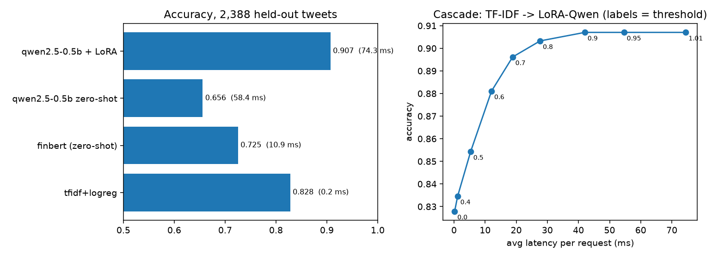

# fin-lora

Which model should classify financial news sentiment, and when is an LLM worth its cost? Four model families on
the same 2,388 held-out tweets (`zeroshot/twitter-financial-news-sentiment`: Bearish / Bullish / Neutral), plus a
confidence **cascade** that sends only uncertain tweets to the expensive model.



## Results

| Model | Params (M) | Accuracy | Macro-F1 | Latency p50 (batch 1, Apple MPS) |
|---|---|---|---|---|
| tfidf+logreg | - | 0.828 | 0.746 | 0.2 ms |
| finbert (zero-shot) | 110.0 | 0.725 | 0.668 | 10.9 ms |
| qwen2.5-0.5b zero-shot | 494.0 | 0.656 | 0.310 | 58.4 ms |
| qwen2.5-0.5b + LoRA | 502.8 | 0.907 | 0.880 | 74.3 ms |

- **LoRA fine-tuning is what makes a small LLM useful:** Qwen2.5-0.5B goes from 0.656 accuracy / 0.310 macro-F1
  zero-shot (it mostly says "Neutral") to 0.907 / 0.880 after one epoch of LoRA (r=16, all linear layers, 8.8M
  trainable parameters, 14.5 min on a laptop GPU, 8,588 training tweets).
- **The fair baseline is TF-IDF + logistic regression, not the zero-shot rows:** it is supervised on the same data.
  LoRA-Qwen beats it by 7.9 points accuracy and 0.134 macro-F1, at ~370x the latency (74 ms vs 0.2 ms).
- **A finance-specific encoder zero-shot (FinBERT, 72.5%) loses to a plain TF-IDF model trained on this data:**
  domain pretraining alone did not replace task-specific labels here (plausibly a label-scheme and tweet-style mismatch, which this benchmark did not isolate).

## Routing: use the LLM only when needed

`finlora.router.cascade` answers with TF-IDF unless its top-class probability is below a threshold, then
escalates to LoRA-Qwen.

| Threshold | Escalated | Accuracy | Avg latency |
|---|---|---|---|
| never (TF-IDF only) | 0% | 0.828 | 0.2 ms |
| 0.6 | 16% | 0.881 | 12.1 ms |
| 0.7 | 25% | 0.896 | 18.8 ms |
| **0.8** | **37%** | **0.903** | **27.7 ms** |
| 0.9 | 56% | 0.907 | 42.0 ms |
| always (LoRA-Qwen only) | 100% | 0.907 | 74.5 ms |

At threshold 0.8 the cascade gives up 0.4 points of accuracy for a 63% cut in average latency. Past 0.9 escalation
buys nothing. The latency "cost" is a proxy; the same ratio applies to GPU-hours or API spend.

## Caveats

- Threshold 0.8 was fixed before this sweep and the table is computed on the test split; choose the threshold on
  the dev split (`splits()` returns one) for any real deployment.
- One dataset, one seed, one epoch, one base model; no confidence intervals. Differences under ~1 point (e.g.
  threshold 0.9 vs always-LLM) are within noise on 2,388 examples (95% CI roughly +/-1.2 points).
- Latency is batch-size-1 on an Apple M-series GPU and includes padding to 96 tokens; expect different absolute
  numbers on other hardware, similar ratios.
- Tweets only. News articles, filings and non-English text are out of distribution.

## Run

```bash
pip install torch transformers peft datasets scikit-learn matplotlib
python train_lora.py            # ~15 min on Apple MPS; writes adapters/
python run_arena.py             # writes arena.json, test_probs.npz
python -m pytest tests          # router + arena tests
```

Served behind an authenticated API, with this cascade, in `../finarena`.

## License

Code: MIT. Base model Qwen2.5-0.5B-Instruct: Apache-2.0. Check the dataset card before commercial use.
